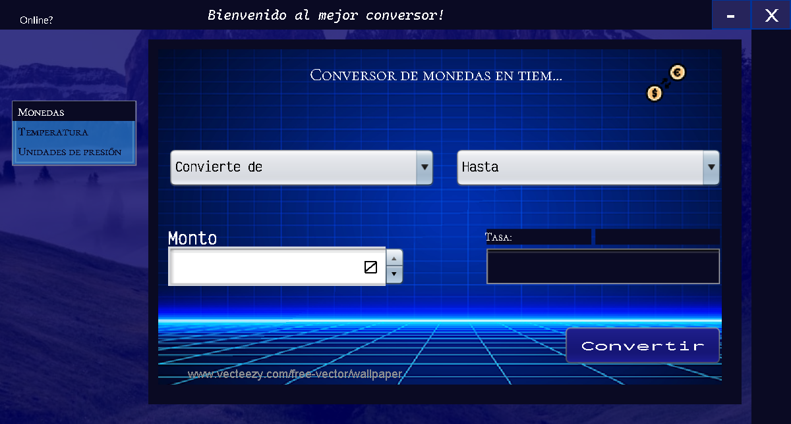

<h1 align="center"> Currencies converter and others </h1>

Project description:

Currency converter and others, it is an application
Mainly designed to convert currencies in real time, with support for more than 169 different types of currencies around the world including Bitcoin and Gold.
Also with this app you can convert different types of temperature units and pressure units. All this with a very intuitive and easy-to-use interface.

Used technology:

JDK 19
org.json

<h1 align="center"> Conversor de divisas y otros </h1>

Descripción del proyecto:

Conversor de divisas y otros, es una aplicación 
diseñada principalmente para convertir divisas en tiempo real, con soporte para mas de 169 tipos diferentes de monedas direntes alrededor del mundo entre ellas Bitcoin y Oro.
Tambien con esta app puedes convertir diferentes tipos de  unidades temperaturas y unidades de presión.Todo esto con unaa interfaz muy intuitiva y faciol de usar.

 Tecnologías utilizadas:

JDK 19
org.json